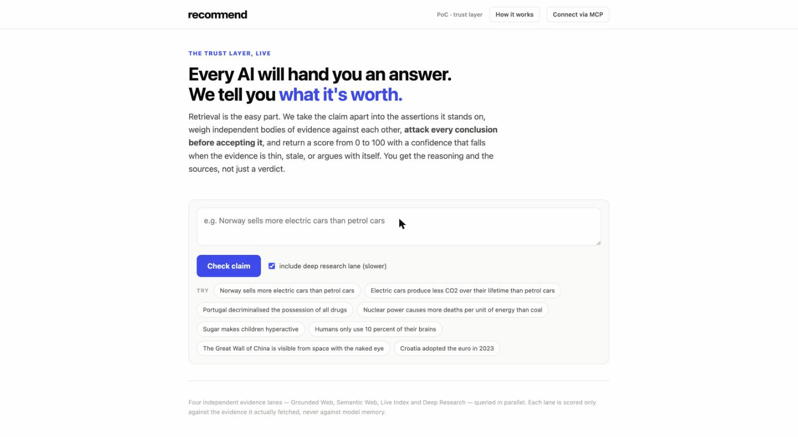

# Recommend Agentic Trust Layer

**A claim goes in. A truth score 0–100 and a *separate, honest* confidence come out — with the sources and the reasoning, not just a verdict.**

The agentic trust layer for your AI stack: a deterministic verification pipeline your
agents call before they act on something. Not another agent — the thing that tells your
agents what's true.



Ask any LLM "how sure are you?" and it says ~95–100% on almost everything, including its
mistakes. The product is not the answer — anyone can produce an answer. The product is
**what the answer is worth**. Nothing here is answered from model memory: every judgement is
made against text fetched live for that specific claim, and the confidence *falls* when the
evidence is thin, stale, or argues with itself.

Two numbers, deliberately separate:

* **Truth score 0–100** — above 50 leans true. This is about the *claim*.
* **Confidence** — how much to trust *our verdict*. Falls when lanes disagree, when a lane
  comes back empty, when the adversarial pass breaks a lane, or when the claim is the kind
  evidence cannot settle.

No framework, no build step: one Python stdlib server (`server.py`), one HTML file
(`index.html`), SSE streaming so you watch the evidence lanes land live.

## Quickstart

```bash
git clone https://github.com/recommend-dev/recommend-agentic-trust-layer.git
cd recommend-agentic-trust-layer
pip install -r requirements.txt        # just `requests` (+ google-auth for the Vertex path)
cp .env.example .env                   # add GEMINI_API_KEY + EXA_API_KEY — that's the minimum
python3 server.py                      # → http://localhost:8899
```

Works with **two keys**: a free Gemini key ([aistudio.google.com/apikey](https://aistudio.google.com/apikey))
and an [Exa](https://exa.ai) key. Better with more — a lane whose key is missing simply sits
the check out and the verdict says so (a silent lane costs confidence; it never fakes coverage).

## Pipeline

```
claim
 └─ 1. STRUCTURE (Gemini)  → normalized falsifiable sentence, claim_type, entities,
                             sub-claims, 3 query angles (one hunting contradiction)
 └─ 2. LANES (parallel, routed by claim_type)
        always      : Grounded Web · Semantic Web · Live Index
        + deep      : Deep Research            (checkbox)
        + predictive: Prediction Market        (auto)
        + causal /
          statistical: Research Literature     (auto)
 └─ 3. JUDGE per lane   — only against what THAT lane fetched, background knowledge forbidden
 └─ 3b CHALLENGE per lane — opposing counsel attacks it; if it breaks, strength × 0.55
 └─ 4. SUB-CLAIMS       — each atomic assertion rated against pooled evidence
 └─ 5. AGGREGATE        — strength-weighted; disagreement and silence both cost confidence
 └─ 6. CALIBRATION      — one-way ratchet: may only LOWER confidence, never raise it
 └─ 7. READOUT          — 2-3 plain sentences on what the evidence showed and why
```

### Lane routing (deliberate)

Firing every source at every claim is slower *and* noisier. No prediction market exists for
settled history; a news write-up doesn't settle cause-and-effect. Knowing which authority
settles which kind of question is part of the design.

| Lane | Fires when | Weight | Provider | Key |
|---|---|---|---|---|
| Grounded Web | always | 1.15 | Exa `/answer` per query | `EXA_API_KEY` |
| Semantic Web | always | 0.9 | Exa `/search` | `EXA_API_KEY` |
| Live Index | always | 0.85 | SerpAPI (Google + answer box) | `SERPAPI_API_KEY` |
| Deep Research | `deep=1` | 1.35 | Exa per sub-claim (~7s); `DEEP_ENGINE=parallel` → Parallel.ai (~70s, better citations) | `EXA_API_KEY` / `PARALLEL_API_KEY` |
| Prediction Market | claim_type `predictive` | 1.25 | Polymarket Gamma | free, keyless |
| Research Literature | claim_type `causal` / `statistical` | 1.4 | OpenAlex + Europe PMC | free, keyless |

## Behaviour that took work to get right

* **Unfalsifiable claims never get a factual verdict.** "X is going to attack Y" used to
  return REFUTED at 96%. Absence of reporting about the future is not proof. It now returns a
  capped-confidence *lean* with a note — "nobody credible is reporting this" is real
  information, but we don't pretend to close an open question.
* **The intake step never corrects the claim.** A false claim must be checked *as asserted* —
  silently flipping a myth into its debunking makes the system report the opposite of what
  was asked.
* **A prediction market is belief, not fact.** Its strength is capped so it can inform a lean
  but never carry a verdict on its own.
* **Every prompt knows today's date.** Without it, models guess — and penalise good evidence
  for being "in the future".
* **`(p_true or 0.5)` when every lane said 0.** `0.0` is falsy in Python. The classics.

## MCP — give your agent a `verify_claim` tool

The whole pipeline is exposed as one MCP tool over streamable HTTP (JSON-RPC over
POST `/mcp`), gated on a bearer key. A demo key is auto-generated into `keys.json` on first
run and printed at startup (and shown in the UI on localhost).

```bash
claude mcp add --transport http recommend-trust \
  http://localhost:8899/mcp \
  --header "Authorization: Bearer <key from startup output>"
```

Returns verdict, score, confidence, per-lane breakdown with challenge flags, verified
sub-claims with verdicts, and sources. Point your agent at it and stop letting it answer
factual questions from memory.

## Tracking

Any verdict can be pinned to your session and is re-checked on a schedule
(`TRACK_EVERY_H`, default 24h), so you can watch a claim's score move as the evidence does.

## Spend guards

Every check costs real API credit, so the server ships with per-IP and global daily caps
(`PER_IP_DAY=25`, `GLOBAL_DAY=400`) — tune them in `.env` before putting an instance on a
public host.

## Tests

Real-Chrome E2E tests (macOS Chrome path is hardcoded in the scripts — adjust
`executablePath` for your OS):

```bash
cd tests && npm install
node uitest.js      # UI invariants (modal, gauge, MCP card, vendor-name leak check)
node tracktest.js   # tracking flow
node cmptest.js     # compare endpoint
node scaletest.js   # layout at widths
```

## Deploying behind a reverse proxy

The front-end derives every path from `location.pathname`, so it works at `/` locally and
under any path prefix in production — don't reintroduce absolute `/api/...` paths. If your
proxy buffers responses (Caddy, nginx), disable buffering for this route
(Caddy: `flush_interval -1`) or SSE will never stream. Set `HOST=0.0.0.0` to listen beyond
localhost.

## Roadmap

- **OKF integration.** Google's [Open Knowledge Format v0.2](https://github.com/GoogleCloudPlatform/knowledge-catalog/tree/main/okf)
  just standardized `generated_by` / `verified_by` / trust-tier fields for agent-written
  knowledge — slots for a verdict, with no machine to produce one. We're building the
  verifier that fills them: walk an OKF bundle, fact-check each concept's load-bearing
  claims, stamp the result with evidence and a calibrated confidence instead of a
  self-reported signature.
- **Pluggable lanes.** Add your own evidence lane (Brave Search, internal corpus, …)
  without touching the pipeline.

## License

[MIT](LICENSE) · built by [Recommend](https://recommend.studio)
